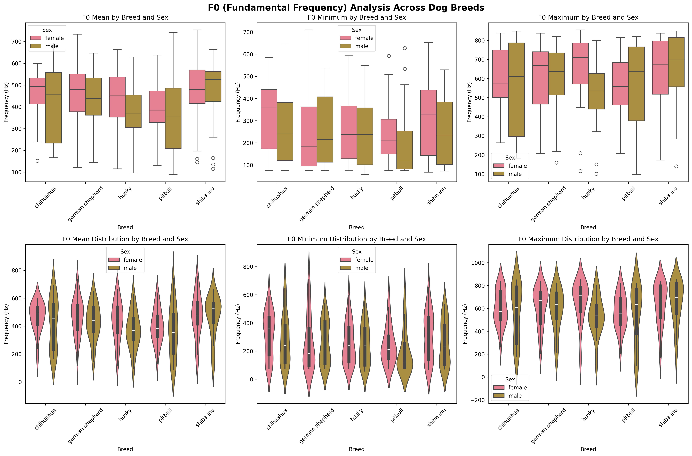
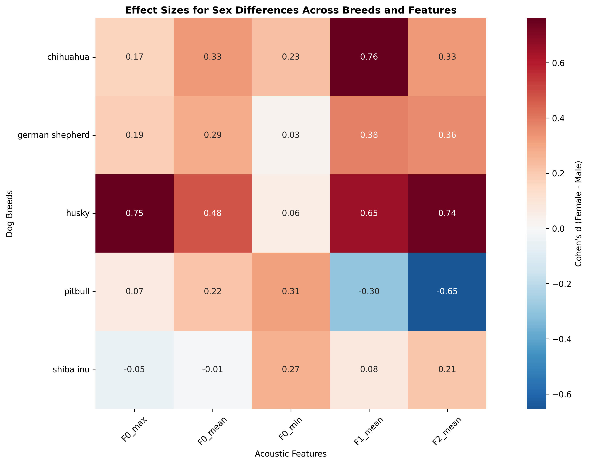
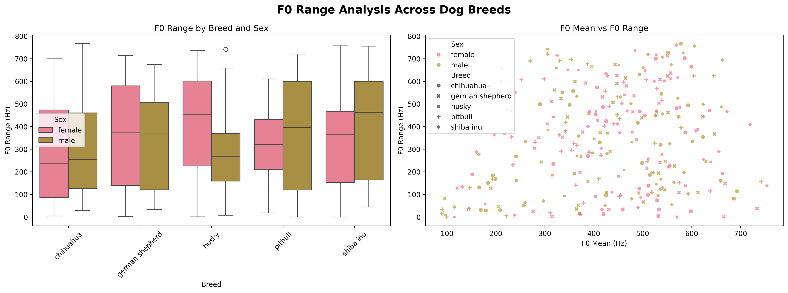

# Statistical Analysis Report: Vocal Dimorphism in Dog Breeds

**Analysis Date:** 2025-10-18 17:40:33

**Research Question:** Are there differences in the way vocal dimorphism is modulated in different dog breeds?

**Data Source:** DogSpeak_Dataset from HuggingFace (ArlingtonCL2/DogSpeak_Dataset)

---

## Dataset Overview

- **Total samples:** 298
- **Breeds:** ['chihuahua', 'german shepherd', 'husky', 'pitbull', 'shiba inu']

### Sex Distribution
- male: 150
- female: 148

### Missing Values
- No missing values found

**Zero values in F0_mean:** 10
**Samples after removing F0=0:** 288

### Breed Size Distribution
- large: 118
- medium: 60
- small: 55
- medium-large: 55

---

## Descriptive Statistics

### Summary Statistics by Breed and Sex

```
                       F0_mean                  F0_min          F0_max         F1_mean          F2_mean        
                         count    mean     std    mean     std    mean     std    mean     std     mean     std
Breed           Sex                                                                                            
chihuahua       female      27  466.17  108.72  315.72  159.32  608.34  154.04  987.85  173.80  1681.12  176.80
                male        28  417.71  179.26  277.69  175.83  574.75  241.20  851.46  184.07  1615.26  223.21
german shepherd female      29  467.32  134.73  260.74  192.86  620.08  170.85  816.66  202.73  1632.17  253.54
                male        29  429.84  127.68  255.35  149.54  586.91  184.19  737.97  209.05  1551.27  192.02
husky           female      30  434.26  141.99  252.08  144.96  664.26  179.74  797.24  189.03  1660.75  250.55
                male        30  368.93  131.42  243.70  142.33  533.01  169.02  686.52  150.12  1478.98  238.72
pitbull         female      28  398.41  121.13  238.21  134.29  567.64  152.51  730.62  204.99  1605.10  290.52
                male        27  364.43  185.37  193.22  156.62  552.83  256.40  791.11  201.00  1767.42  195.17
shiba inu       female      30  471.18  154.90  301.63  170.67  642.10  183.78  884.00  173.95  1732.93  274.24
                male        30  472.41  148.17  256.78  156.44  651.27  191.64  866.74  254.61  1674.59  283.30
```

---

## Assumption Testing

### Normality Test for F0_mean

| Breed | Sex | W-statistic | p-value |
|-------|-----|-------------|---------|
| chihuahua | female | 0.907 | 0.019 |
| chihuahua | male | 0.906 | 0.016 |
| german shepherd | female | 0.975 | 0.702 |
| german shepherd | male | 0.974 | 0.667 |
| husky | female | 0.969 | 0.521 |
| husky | male | 0.982 | 0.869 |
| pitbull | female | 0.989 | 0.991 |
| pitbull | male | 0.963 | 0.422 |
| shiba inu | female | 0.967 | 0.471 |
| shiba inu | male | 0.874 | 0.002 |

### Normality Test for F0_min

| Breed | Sex | W-statistic | p-value |
|-------|-----|-------------|---------|
| chihuahua | female | 0.926 | 0.054 |
| chihuahua | male | 0.897 | 0.010 |
| german shepherd | female | 0.856 | 0.001 |
| german shepherd | male | 0.895 | 0.008 |
| husky | female | 0.922 | 0.030 |
| husky | male | 0.937 | 0.075 |
| pitbull | female | 0.921 | 0.036 |
| pitbull | male | 0.767 | 0.000 |
| shiba inu | female | 0.934 | 0.064 |
| shiba inu | male | 0.897 | 0.007 |

### Normality Test for F0_max

| Breed | Sex | W-statistic | p-value |
|-------|-----|-------------|---------|
| chihuahua | female | 0.956 | 0.299 |
| chihuahua | male | 0.862 | 0.002 |
| german shepherd | female | 0.907 | 0.014 |
| german shepherd | male | 0.919 | 0.028 |
| husky | female | 0.846 | 0.001 |
| husky | male | 0.951 | 0.181 |
| pitbull | female | 0.975 | 0.706 |
| pitbull | male | 0.837 | 0.001 |
| shiba inu | female | 0.888 | 0.004 |
| shiba inu | male | 0.883 | 0.003 |

### Normality Test for F1_mean

| Breed | Sex | W-statistic | p-value |
|-------|-----|-------------|---------|
| chihuahua | female | 0.935 | 0.094 |
| chihuahua | male | 0.981 | 0.863 |
| german shepherd | female | 0.968 | 0.519 |
| german shepherd | male | 0.966 | 0.463 |
| husky | female | 0.937 | 0.076 |
| husky | male | 0.965 | 0.409 |
| pitbull | female | 0.981 | 0.866 |
| pitbull | male | 0.969 | 0.574 |
| shiba inu | female | 0.991 | 0.996 |
| shiba inu | male | 0.955 | 0.230 |

### Normality Test for F2_mean

| Breed | Sex | W-statistic | p-value |
|-------|-----|-------------|---------|
| chihuahua | female | 0.887 | 0.007 |
| chihuahua | male | 0.983 | 0.908 |
| german shepherd | female | 0.984 | 0.930 |
| german shepherd | male | 0.974 | 0.660 |
| husky | female | 0.963 | 0.379 |
| husky | male | 0.964 | 0.400 |
| pitbull | female | 0.946 | 0.155 |
| pitbull | male | 0.961 | 0.386 |
| shiba inu | female | 0.967 | 0.455 |
| shiba inu | male | 0.982 | 0.884 |

### Homogeneity of Variance Tests (Levene's Test)

| Feature | Levene Statistic | p-value |
|---------|------------------|---------|
| F0_mean | 1.996 | 0.040 |
| F0_min | 0.910 | 0.517 |
| F0_max | 1.693 | 0.090 |
| F1_mean | 1.241 | 0.270 |
| F2_mean | 1.196 | 0.297 |

---

## Linear Mixed-Effects Models

**Model Formula:** `feature ~ Sex * Breed + (1 | dog_id)`

### Model Results: F0_mean

#### Full Model Summary
```
                       Mixed Linear Model Regression Results
====================================================================================
Model:                      MixedLM          Dependent Variable:          F0_mean   
No. Observations:           288              Method:                      REML      
No. Groups:                 100              Scale:                       17768.5190
Min. group size:            1                Log-Likelihood:              -1791.6282
Max. group size:            3                Converged:                   Yes       
Mean group size:            2.9                                                     
------------------------------------------------------------------------------------
                                      Coef.   Std.Err.   z    P>|z|  [0.025   0.975]
------------------------------------------------------------------------------------
Intercept                             466.806   31.888 14.639 0.000  404.307 529.306
Sex[T.male]                           -49.340   44.813 -1.101 0.271 -137.172  38.491
Breed[T.german shepherd]                0.599   44.541  0.013 0.989  -86.700  87.897
Breed[T.husky]                        -32.546   44.281 -0.735 0.462 -119.335  54.243
Breed[T.pitbull]                      -67.096   44.905 -1.494 0.135 -155.109  20.917
Breed[T.shiba inu]                      4.374   44.281  0.099 0.921  -82.415  91.163
Sex[T.male]:Breed[T.german shepherd]   11.178   62.787  0.178 0.859 -111.883 134.238
Sex[T.male]:Breed[T.husky]            -15.986   62.419 -0.256 0.798 -138.325 106.352
Sex[T.male]:Breed[T.pitbull]           12.224   63.445  0.193 0.847 -112.126 136.573
Sex[T.male]:Breed[T.shiba inu]         50.570   62.419  0.810 0.418  -71.768 172.909
Group Var                            3516.713   13.260                              
====================================================================================

```

#### Key Results

**Sex effect (male vs female):** -49.340 (p=0.271)

**Breed Effects (vs reference breed):**
- german shepherd: 0.599 (p=0.989)
- husky: -32.546 (p=0.462)
- pitbull: -67.096 (p=0.135)
- shiba inu: 4.374 (p=0.921)

**Interaction Effects (Sex × Breed):**
- Male × german shepherd: 11.178 (p=0.859)
- Male × husky: -15.986 (p=0.798)
- Male × pitbull: 12.224 (p=0.847)
- Male × shiba inu: 50.570 (p=0.418)

### Model Results: F0_min

#### Full Model Summary
```
                       Mixed Linear Model Regression Results
===================================================================================
Model:                     MixedLM          Dependent Variable:          F0_min    
No. Observations:          288              Method:                      REML      
No. Groups:                100              Scale:                       24572.8657
Min. group size:           1                Log-Likelihood:              -1820.4948
Max. group size:           3                Converged:                   Yes       
Mean group size:           2.9                                                     
-----------------------------------------------------------------------------------
                                      Coef.  Std.Err.   z    P>|z|  [0.025   0.975]
-----------------------------------------------------------------------------------
Intercept                            316.272   31.519 10.034 0.000  254.496 378.048
Sex[T.male]                          -38.744   44.197 -0.877 0.381 -125.368  47.881
Breed[T.german shepherd]             -55.888   43.859 -1.274 0.203 -141.851  30.074
Breed[T.husky]                       -64.188   43.504 -1.475 0.140 -149.454  21.077
Breed[T.pitbull]                     -77.770   44.201 -1.759 0.078 -164.402   8.861
Breed[T.shiba inu]                   -14.642   43.504 -0.337 0.736  -99.907  70.624
Sex[T.male]:Breed[T.german shepherd]  33.559   61.734  0.544 0.587  -87.437 154.555
Sex[T.male]:Breed[T.husky]            30.360   61.251  0.496 0.620  -89.689 150.409
Sex[T.male]:Breed[T.pitbull]          -7.082   62.490 -0.113 0.910 -129.560 115.395
Sex[T.male]:Breed[T.shiba inu]        -6.106   61.251 -0.100 0.921 -126.155 113.943
Group Var                            800.263   10.751                              
===================================================================================

```

#### Key Results

**Sex effect (male vs female):** -38.744 (p=0.381)

**Breed Effects (vs reference breed):**
- german shepherd: -55.888 (p=0.203)
- husky: -64.188 (p=0.140)
- pitbull: -77.770 (p=0.078)
- shiba inu: -14.642 (p=0.736)

**Interaction Effects (Sex × Breed):**
- Male × german shepherd: 33.559 (p=0.587)
- Male × husky: 30.360 (p=0.620)
- Male × pitbull: -7.082 (p=0.910)
- Male × shiba inu: -6.106 (p=0.921)

### Model Results: F0_max

#### Full Model Summary
```
                       Mixed Linear Model Regression Results
====================================================================================
Model:                      MixedLM          Dependent Variable:          F0_max    
No. Observations:           288              Method:                      REML      
No. Groups:                 100              Scale:                       27133.5757
Min. group size:            1                Log-Likelihood:              -1862.6234
Max. group size:            3                Converged:                   Yes       
Mean group size:            2.9                                                     
------------------------------------------------------------------------------------
                                      Coef.   Std.Err.   z    P>|z|  [0.025   0.975]
------------------------------------------------------------------------------------
Intercept                             608.683   44.934 13.546 0.000  520.615 696.751
Sex[T.male]                           -35.124   63.228 -0.556 0.579 -159.049  88.802
Breed[T.german shepherd]               11.220   62.921  0.178 0.858 -112.103 134.542
Breed[T.husky]                         55.577   62.624  0.887 0.375  -67.164 178.318
Breed[T.pitbull]                      -40.162   63.398 -0.633 0.526 -164.419  84.095
Breed[T.shiba inu]                     33.420   62.624  0.534 0.594  -89.320 156.161
Sex[T.male]:Breed[T.german shepherd]    2.802   88.758  0.032 0.975 -171.159 176.764
Sex[T.male]:Breed[T.husky]            -96.126   88.336 -1.088 0.277 -269.262  77.009
Sex[T.male]:Breed[T.pitbull]           14.322   89.542  0.160 0.873 -161.177 189.822
Sex[T.male]:Breed[T.shiba inu]         44.287   88.336  0.501 0.616 -128.848 217.423
Group Var                            9982.635   21.703                              
====================================================================================

```

#### Key Results

**Sex effect (male vs female):** -35.124 (p=0.579)

**Breed Effects (vs reference breed):**
- german shepherd: 11.220 (p=0.858)
- husky: 55.577 (p=0.375)
- pitbull: -40.162 (p=0.526)
- shiba inu: 33.420 (p=0.594)

**Interaction Effects (Sex × Breed):**
- Male × german shepherd: 2.802 (p=0.975)
- Male × husky: -96.126 (p=0.277)
- Male × pitbull: 14.322 (p=0.873)
- Male × shiba inu: 44.287 (p=0.616)

### Model Results: F1_mean

#### Full Model Summary
```
                        Mixed Linear Model Regression Results
======================================================================================
Model:                      MixedLM           Dependent Variable:           F1_mean   
No. Observations:           288               Method:                       REML      
No. Groups:                 100               Scale:                        26566.6002
Min. group size:            1                 Log-Likelihood:               -1866.4380
Max. group size:            3                 Converged:                    Yes       
Mean group size:            2.9                                                       
--------------------------------------------------------------------------------------
                                       Coef.   Std.Err.   z    P>|z|  [0.025   0.975] 
--------------------------------------------------------------------------------------
Intercept                              986.884   47.838 20.630 0.000  893.124 1080.645
Sex[T.male]                           -140.138   67.358 -2.080 0.037 -272.157   -8.119
Breed[T.german shepherd]              -165.669   67.073 -2.470 0.014 -297.129  -34.208
Breed[T.husky]                        -189.644   66.788 -2.839 0.005 -320.546  -58.742
Breed[T.pitbull]                      -259.212   67.550 -3.837 0.000 -391.607 -126.816
Breed[T.shiba inu]                    -102.881   66.788 -1.540 0.123 -233.783   28.021
Sex[T.male]:Breed[T.german shepherd]    56.363   94.636  0.596 0.551 -129.120  241.847
Sex[T.male]:Breed[T.husky]              29.415   94.242  0.312 0.755 -155.295  214.125
Sex[T.male]:Breed[T.pitbull]           197.497   95.392  2.070 0.038   10.533  384.462
Sex[T.male]:Breed[T.shiba inu]         122.871   94.242  1.304 0.192  -61.839  307.581
Group Var                            12866.336   24.681                               
======================================================================================

```

#### Key Results

**Sex effect (male vs female):** -140.138 (p=0.037)

**Breed Effects (vs reference breed):**
- german shepherd: -165.669 (p=0.014)
- husky: -189.644 (p=0.005)
- pitbull: -259.212 (p=0.000)
- shiba inu: -102.881 (p=0.123)

**Interaction Effects (Sex × Breed):**
- Male × german shepherd: 56.363 (p=0.551)
- Male × husky: 29.415 (p=0.755)
- Male × pitbull: 197.497 (p=0.038)
- Male × shiba inu: 122.871 (p=0.192)

### Model Results: F2_mean

#### Full Model Summary
```
                        Mixed Linear Model Regression Results
======================================================================================
Model:                      MixedLM           Dependent Variable:           F2_mean   
No. Observations:           288               Method:                       REML      
No. Groups:                 100               Scale:                        47586.8498
Min. group size:            1                 Log-Likelihood:               -1932.2792
Max. group size:            3                 Converged:                    Yes       
Mean group size:            2.9                                                       
--------------------------------------------------------------------------------------
                                       Coef.   Std.Err.   z    P>|z|  [0.025   0.975] 
--------------------------------------------------------------------------------------
Intercept                             1680.368   54.321 30.934 0.000 1573.901 1786.834
Sex[T.male]                            -68.895   76.374 -0.902 0.367 -218.586   80.796
Breed[T.german shepherd]               -44.710   75.946 -0.589 0.556 -193.563  104.142
Breed[T.husky]                         -19.618   75.521 -0.260 0.795 -167.636  128.400
Breed[T.pitbull]                       -78.992   76.552 -1.032 0.302 -229.032   71.048
Breed[T.shiba inu]                      52.559   75.521  0.696 0.486  -95.460  200.577
Sex[T.male]:Breed[T.german shepherd]   -14.434  107.068 -0.135 0.893 -224.284  195.416
Sex[T.male]:Breed[T.husky]            -112.875  106.482 -1.060 0.289 -321.576   95.826
Sex[T.male]:Breed[T.pitbull]           239.146  108.179  2.211 0.027   27.118  451.174
Sex[T.male]:Breed[T.shiba inu]          10.558  106.482  0.099 0.921 -198.143  219.259
Group Var                            11664.564   23.549                               
======================================================================================

```

#### Key Results

**Sex effect (male vs female):** -68.895 (p=0.367)

**Breed Effects (vs reference breed):**
- german shepherd: -44.710 (p=0.556)
- husky: -19.618 (p=0.795)
- pitbull: -78.992 (p=0.302)
- shiba inu: 52.559 (p=0.486)

**Interaction Effects (Sex × Breed):**
- Male × german shepherd: -14.434 (p=0.893)
- Male × husky: -112.875 (p=0.289)
- Male × pitbull: 239.146 (p=0.027)
- Male × shiba inu: 10.558 (p=0.921)

---

## Effect Sizes (Cohen's d) for Sex Differences

### CHIHUAHUA

| Feature | Cohen's d | t-statistic | p-value |
|---------|-----------|-------------|---------|
| F0_mean | 0.325 | 1.207 | 0.233 |
| F0_min | 0.226 | 0.840 | 0.405 |
| F0_max | 0.165 | 0.613 | 0.542 |
| F1_mean | 0.762 | 2.823 | 0.007 |
| F2_mean | 0.326 | 1.210 | 0.232 |

### GERMAN SHEPHERD

| Feature | Cohen's d | t-statistic | p-value |
|---------|-----------|-------------|---------|
| F0_mean | 0.286 | 1.088 | 0.281 |
| F0_min | 0.031 | 0.119 | 0.906 |
| F0_max | 0.187 | 0.711 | 0.480 |
| F1_mean | 0.382 | 1.455 | 0.151 |
| F2_mean | 0.360 | 1.370 | 0.176 |

### HUSKY

| Feature | Cohen's d | t-statistic | p-value |
|---------|-----------|-------------|---------|
| F0_mean | 0.478 | 1.849 | 0.070 |
| F0_min | 0.058 | 0.226 | 0.822 |
| F0_max | 0.752 | 2.914 | 0.005 |
| F1_mean | 0.649 | 2.512 | 0.015 |
| F2_mean | 0.743 | 2.877 | 0.006 |

### PITBULL

| Feature | Cohen's d | t-statistic | p-value |
|---------|-----------|-------------|---------|
| F0_mean | 0.218 | 0.808 | 0.423 |
| F0_min | 0.309 | 1.145 | 0.257 |
| F0_max | 0.071 | 0.262 | 0.795 |
| F1_mean | -0.298 | -1.105 | 0.274 |
| F2_mean | -0.654 | -2.423 | 0.019 |

### SHIBA INU

| Feature | Cohen's d | t-statistic | p-value |
|---------|-----------|-------------|---------|
| F0_mean | -0.008 | -0.031 | 0.975 |
| F0_min | 0.274 | 1.061 | 0.293 |
| F0_max | -0.049 | -0.189 | 0.851 |
| F1_mean | 0.079 | 0.307 | 0.760 |
| F2_mean | 0.209 | 0.810 | 0.421 |

---

## Visualizations


*Figure 1: Box plots (top row) and violin plots (bottom row) showing the distribution of acoustic features by breed and sex.*



*Figure 3: Box plots (top row) and violin plots (bottom row) showing all F0 measures (mean, minimum, maximum) by breed and sex. This provides a comprehensive view of fundamental frequency patterns.*



*Figure 2: Heatmap showing Cohen's d effect sizes for sex differences across breeds and all acoustic features. Positive values indicate females have higher values than males.*

### F0 Range Analysis

Understanding F0 range (F0_max - F0_min) can provide insights into vocal flexibility:

| Breed | Sex | Mean F0 Range (Hz) | Std F0 Range |
|-------|-----|-------------------|--------------|
| chihuahua | female | 292.6 | 234.9 |
| chihuahua | male | 297.1 | 213.0 |
| german shepherd | female | 359.3 | 231.8 |
| german shepherd | male | 331.6 | 213.7 |
| husky | female | 412.2 | 214.7 |
| husky | male | 289.3 | 188.1 |
| pitbull | female | 329.4 | 176.6 |
| pitbull | male | 359.6 | 257.8 |
| shiba inu | female | 340.5 | 220.0 |
| shiba inu | male | 394.5 | 244.8 |



*Figure 4: F0 range analysis showing vocal flexibility. Left: F0 range by breed and sex. Right: Relationship between F0 mean and range.*

---

## Summary and Interpretation

### Research Hypotheses Testing

1. **Males will show lower F0 and Formant frequencies than females:**
   - Check the sign of Sex[T.male] coefficients in the models above
   - Negative coefficients support this hypothesis

2. **Larger breeds will show larger acoustic differences:**
   - Compare effect sizes (Cohen's d) across breeds
   - Larger breeds (German Shepherd, Husky) should show larger effects

3. **Small breeds will show smaller or no differences:**
   - Chihuahua should show smaller effect sizes
   - Look for non-significant interactions in small breeds

4. **F0 range may show different patterns than mean F0:**
   - F0 range reflects vocal flexibility and dynamic range
   - May vary independently of average F0 values

### Interpretation Guidelines

- **Cohen's d:** 0.2 = small, 0.5 = medium, 0.8 = large effect
- **p < 0.05** indicates statistical significance
- **Interaction effects** show breed-specific sex differences
- **F0_min:** Lowest fundamental frequency in the vocalization
- **F0_max:** Highest fundamental frequency in the vocalization
- **F0_range:** F0_max - F0_min, indicates vocal flexibility

### Model Specification

The Linear Mixed-Effects Models account for:
- **Fixed effects:** Sex, Breed, and their interaction
- **Random effects:** Individual dog variation (dog_id)
- **Separate models** for F0_mean, F0_min, F0_max, F1_mean, and F2_mean

---

**Analysis completed successfully!** All results, figures, and this report have been saved to the `data/statistical_analysis/` directory.
