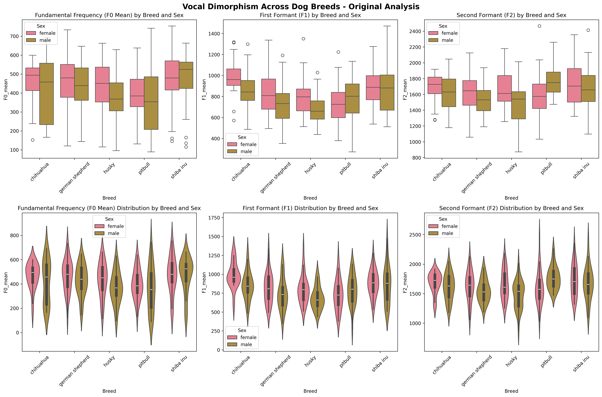

# Statistical Analysis Report: Vocal Dimorphism in Dog Breeds

**Analysis Date:** 2025-10-13 18:23:50

**Research Question:** Are there differences in the way vocal dimorphism is modulated in different dog breeds?

**Data Source:** DogSpeak_Dataset from HuggingFace (ArlingtonCL2/DogSpeak_Dataset)

---

## Dataset Overview

- **Total samples:** 298
- **Breeds:** ['chihuahua', 'german shepherd', 'husky', 'pitbull', 'shiba inu']

### Sex Distribution
- male: 150
- female: 148

### Missing Values
- No missing values found

**Zero values in F0_mean:** 12
**Samples after removing F0=0:** 286

### Breed Size Distribution
- large: 117
- medium: 59
- small: 55
- medium-large: 55

---

## Descriptive Statistics

### Summary Statistics by Breed and Sex

```
                       F0_mean                 F1_mean          F2_mean        
                         count    mean     std    mean     std     mean     std
Breed           Sex                                                            
chihuahua       female      27  348.95   83.87  987.85  173.80  1681.12  176.80
                male        28  302.99   86.68  851.46  184.07  1615.26  223.21
german shepherd female      29  309.99   79.97  796.62  176.47  1606.01  258.05
                male        28  303.16   73.58  725.37  201.36  1542.06  188.90
husky           female      30  303.45   87.96  797.24  189.03  1660.75  250.55
                male        30  305.07   80.55  686.52  150.12  1478.98  238.72
pitbull         female      28  316.67   75.26  730.62  204.99  1605.10  290.52
                male        27  253.12  119.03  791.11  201.00  1767.42  195.17
shiba inu       female      29  341.20   85.49  870.47  160.14  1720.21  269.94
                male        30  320.53   90.95  866.74  254.61  1674.59  283.30
```

---

## Assumption Testing

### Normality Test for F0_mean

| Breed | Sex | W-statistic | p-value |
|-------|-----|-------------|---------|
| chihuahua | female | 0.849 | 0.001 |
| chihuahua | male | 0.928 | 0.056 |
| german shepherd | female | 0.932 | 0.063 |
| german shepherd | male | 0.967 | 0.513 |
| husky | female | 0.930 | 0.049 |
| husky | male | 0.917 | 0.022 |
| pitbull | female | 0.957 | 0.296 |
| pitbull | male | 0.912 | 0.026 |
| shiba inu | female | 0.953 | 0.217 |
| shiba inu | male | 0.925 | 0.037 |

### Normality Test for F1_mean

| Breed | Sex | W-statistic | p-value |
|-------|-----|-------------|---------|
| chihuahua | female | 0.935 | 0.094 |
| chihuahua | male | 0.981 | 0.863 |
| german shepherd | female | 0.976 | 0.718 |
| german shepherd | male | 0.968 | 0.534 |
| husky | female | 0.937 | 0.076 |
| husky | male | 0.965 | 0.409 |
| pitbull | female | 0.981 | 0.866 |
| pitbull | male | 0.969 | 0.574 |
| shiba inu | female | 0.981 | 0.873 |
| shiba inu | male | 0.955 | 0.230 |

### Normality Test for F2_mean

| Breed | Sex | W-statistic | p-value |
|-------|-----|-------------|---------|
| chihuahua | female | 0.887 | 0.007 |
| chihuahua | male | 0.983 | 0.908 |
| german shepherd | female | 0.982 | 0.881 |
| german shepherd | male | 0.972 | 0.638 |
| husky | female | 0.963 | 0.379 |
| husky | male | 0.964 | 0.400 |
| pitbull | female | 0.946 | 0.155 |
| pitbull | male | 0.961 | 0.386 |
| shiba inu | female | 0.966 | 0.458 |
| shiba inu | male | 0.982 | 0.884 |

### Homogeneity of Variance Tests (Levene's Test)

| Feature | Levene Statistic | p-value |
|---------|------------------|---------|
| F0_mean | 1.939 | 0.047 |
| F1_mean | 1.319 | 0.227 |
| F2_mean | 1.161 | 0.320 |

---

## Linear Mixed-Effects Models

**Model Formula:** `feature ~ Sex * Breed + (1 | dog_id)`

### Model Results: F0_mean

#### Full Model Summary
```
                       Mixed Linear Model Regression Results
====================================================================================
Model:                      MixedLM          Dependent Variable:          F0_mean   
No. Observations:           286              Method:                      REML      
No. Groups:                 100              Scale:                       6024.6667 
Min. group size:            1                Log-Likelihood:              -1635.4795
Max. group size:            3                Converged:                   Yes       
Mean group size:            2.9                                                     
------------------------------------------------------------------------------------
                                      Coef.   Std.Err.   z    P>|z|  [0.025   0.975]
------------------------------------------------------------------------------------
Intercept                             349.004   19.792 17.633 0.000  310.212 387.796
Sex[T.male]                           -46.953   27.834 -1.687 0.092 -101.507   7.600
Breed[T.german shepherd]              -38.341   27.682 -1.385 0.166  -92.596  15.913
Breed[T.husky]                        -45.550   27.535 -1.654 0.098  -99.518   8.418
Breed[T.pitbull]                      -30.780   27.904 -1.103 0.270  -85.471  23.911
Breed[T.shiba inu]                     -7.238   27.681 -0.261 0.794  -61.493  47.016
Sex[T.male]:Breed[T.german shepherd]   39.768   39.142  1.016 0.310  -36.949 116.486
Sex[T.male]:Breed[T.husky]             48.573   38.828  1.251 0.211  -27.529 124.675
Sex[T.male]:Breed[T.pitbull]          -18.468   39.410 -0.469 0.639  -95.711  58.775
Sex[T.male]:Breed[T.shiba inu]         25.722   38.931  0.661 0.509  -50.582 102.025
Group Var                            1656.332    8.767                              
====================================================================================

```

#### Key Results

**Sex effect (male vs female):** -46.953 (p=0.092)

**Breed Effects (vs reference breed):**
- german shepherd: -38.341 (p=0.166)
- husky: -45.550 (p=0.098)
- pitbull: -30.780 (p=0.270)
- shiba inu: -7.238 (p=0.794)

**Interaction Effects (Sex × Breed):**
- Male × german shepherd: 39.768 (p=0.310)
- Male × husky: 48.573 (p=0.211)
- Male × pitbull: -18.468 (p=0.639)
- Male × shiba inu: 25.722 (p=0.509)

### Model Results: F1_mean

#### Full Model Summary
```
                        Mixed Linear Model Regression Results
======================================================================================
Model:                      MixedLM           Dependent Variable:           F1_mean   
No. Observations:           286               Method:                       REML      
No. Groups:                 100               Scale:                        25560.8798
Min. group size:            1                 Log-Likelihood:               -1847.0124
Max. group size:            3                 Converged:                    Yes       
Mean group size:            2.9                                                       
--------------------------------------------------------------------------------------
                                       Coef.   Std.Err.   z    P>|z|  [0.025   0.975] 
--------------------------------------------------------------------------------------
Intercept                              986.899   46.497 21.225 0.000  895.766 1078.033
Sex[T.male]                           -140.078   65.466 -2.140 0.032 -268.389  -11.767
Breed[T.german shepherd]              -190.141   65.179 -2.917 0.004 -317.890  -62.392
Breed[T.husky]                        -189.659   64.903 -2.922 0.003 -316.867  -62.451
Breed[T.pitbull]                      -259.164   65.651 -3.948 0.000 -387.839 -130.490
Breed[T.shiba inu]                    -116.172   65.179 -1.782 0.075 -243.921   11.577
Sex[T.male]:Breed[T.german shepherd]    72.002   92.176  0.781 0.435 -108.660  252.663
Sex[T.male]:Breed[T.husky]              29.355   91.579  0.321 0.749 -150.136  208.846
Sex[T.male]:Breed[T.pitbull]           197.470   92.712  2.130 0.033   15.758  379.181
Sex[T.male]:Breed[T.shiba inu]         136.088   91.774  1.483 0.138  -43.786  315.962
Group Var                            11983.890   23.745                               
======================================================================================

```

#### Key Results

**Sex effect (male vs female):** -140.078 (p=0.032)

**Breed Effects (vs reference breed):**
- german shepherd: -190.141 (p=0.004)
- husky: -189.659 (p=0.003)
- pitbull: -259.164 (p=0.000)
- shiba inu: -116.172 (p=0.075)

**Interaction Effects (Sex × Breed):**
- Male × german shepherd: 72.002 (p=0.435)
- Male × husky: 29.355 (p=0.749)
- Male × pitbull: 197.470 (p=0.033)
- Male × shiba inu: 136.088 (p=0.138)

### Model Results: F2_mean

#### Full Model Summary
```
                        Mixed Linear Model Regression Results
=====================================================================================
Model:                       MixedLM          Dependent Variable:          F2_mean   
No. Observations:            286              Method:                      REML      
No. Groups:                  100              Scale:                       49207.5127
Min. group size:             1                Log-Likelihood:              -1919.4713
Max. group size:             3                Converged:                   Yes       
Mean group size:             2.9                                                     
-------------------------------------------------------------------------------------
                                      Coef.   Std.Err.   z    P>|z|  [0.025   0.975] 
-------------------------------------------------------------------------------------
Intercept                            1680.467   53.097 31.649 0.000 1576.400 1784.534
Sex[T.male]                           -68.489   74.623 -0.918 0.359 -214.747   77.770
Breed[T.german shepherd]              -72.974   74.170 -0.984 0.325 -218.344   72.395
Breed[T.husky]                        -19.717   73.734 -0.267 0.789 -164.232  124.798
Breed[T.pitbull]                      -78.508   74.779 -1.050 0.294 -225.072   68.056
Breed[T.shiba inu]                     39.945   74.166  0.539 0.590 -105.418  185.309
Sex[T.male]:Breed[T.german shepherd]    5.177  104.876  0.049 0.961 -200.377  210.730
Sex[T.male]:Breed[T.husky]           -113.281  103.939 -1.090 0.276 -316.999   90.436
Sex[T.male]:Breed[T.pitbull]          237.603  105.691  2.248 0.025   30.452  444.754
Sex[T.male]:Breed[T.shiba inu]         22.667  104.246  0.217 0.828 -181.652  226.985
Group Var                            9771.569   21.960                               
=====================================================================================

```

#### Key Results

**Sex effect (male vs female):** -68.489 (p=0.359)

**Breed Effects (vs reference breed):**
- german shepherd: -72.974 (p=0.325)
- husky: -19.717 (p=0.789)
- pitbull: -78.508 (p=0.294)
- shiba inu: 39.945 (p=0.590)

**Interaction Effects (Sex × Breed):**
- Male × german shepherd: 5.177 (p=0.961)
- Male × husky: -113.281 (p=0.276)
- Male × pitbull: 237.603 (p=0.025)
- Male × shiba inu: 22.667 (p=0.828)

---

## Effect Sizes (Cohen's d) for Sex Differences

### CHIHUAHUA

| Feature | Cohen's d | t-statistic | p-value |
|---------|-----------|-------------|---------|
| F0_mean | 0.539 | 1.997 | 0.051 |
| F1_mean | 0.762 | 2.823 | 0.007 |
| F2_mean | 0.326 | 1.210 | 0.232 |

### GERMAN SHEPHERD

| Feature | Cohen's d | t-statistic | p-value |
|---------|-----------|-------------|---------|
| F0_mean | 0.089 | 0.335 | 0.739 |
| F1_mean | 0.377 | 1.422 | 0.161 |
| F2_mean | 0.282 | 1.065 | 0.292 |

### HUSKY

| Feature | Cohen's d | t-statistic | p-value |
|---------|-----------|-------------|---------|
| F0_mean | -0.019 | -0.074 | 0.941 |
| F1_mean | 0.649 | 2.512 | 0.015 |
| F2_mean | 0.743 | 2.877 | 0.006 |

### PITBULL

| Feature | Cohen's d | t-statistic | p-value |
|---------|-----------|-------------|---------|
| F0_mean | 0.641 | 2.376 | 0.021 |
| F1_mean | -0.298 | -1.105 | 0.274 |
| F2_mean | -0.654 | -2.423 | 0.019 |

### SHIBA INU

| Feature | Cohen's d | t-statistic | p-value |
|---------|-----------|-------------|---------|
| F0_mean | 0.234 | 0.898 | 0.373 |
| F1_mean | 0.017 | 0.067 | 0.947 |
| F2_mean | 0.165 | 0.633 | 0.529 |

---

## Visualizations



*Figure 1: Box plots (top row) and violin plots (bottom row) showing the distribution of acoustic features by breed and sex.*


*Figure 2: Heatmap showing Cohen's d effect sizes for sex differences across breeds and acoustic features. Positive values indicate females have higher values than males.*

---

## Summary and Interpretation

### Research Hypotheses Testing

1. **Males will show lower F0 and Formant frequencies than females:**
   - Check the sign of Sex[T.male] coefficients in the models above
   - Negative coefficients support this hypothesis

2. **Larger breeds will show larger acoustic differences:**
   - Compare effect sizes (Cohen's d) across breeds
   - Larger breeds (German Shepherd, Husky) should show larger effects

3. **Small breeds will show smaller or no differences:**
   - Chihuahua should show smaller effect sizes
   - Look for non-significant interactions in small breeds

### Interpretation Guidelines

- **Cohen's d:** 0.2 = small, 0.5 = medium, 0.8 = large effect
- **p < 0.05** indicates statistical significance
- **Interaction effects** show breed-specific sex differences

### Model Specification

The Linear Mixed-Effects Models account for:
- **Fixed effects:** Sex, Breed, and their interaction
- **Random effects:** Individual dog variation (dog_id)

---

**Analysis completed successfully!** All results, figures, and this report have been saved to the `data/statistical_analysis/` directory.
